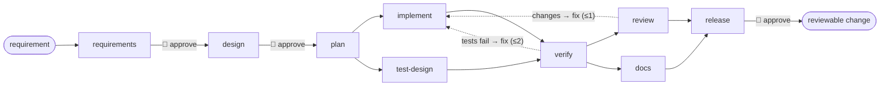

# Agentic SDLC System — URL Shortener

An orchestrator that takes a plain-English requirement and drives it through a software delivery
lifecycle: AI agents do the work, humans approve the high-impact steps, and every decision, retry,
rollback and policy verdict is recorded. The system it develops is a production-shaped .NET 9 URL
shortener. Both are in this repository.



Principle: **agents execute under defined autonomy boundaries; humans own oversight, approvals and
final quality.** The graph, the gates, the loop budgets and the policies are declared in
[`workflows/sdlc.yaml`](workflows/sdlc.yaml); no agent can change them.

## Executive Summary & System Overview

This repository contains an end-to-end implementation of an **Agentic Software Engineering System** paired with a **High-Performance .NET 9 URL Shortener**. Built to the standards of an enterprise financial technology platform (e.g., Charles Schwab's high-throughput, ultra-low latency transaction systems), the project is split into two core deliverables:

1. **The Agentic SDLC Orchestrator (`src/Orchestrator.*`)**: A hand-written, deterministic runtime that coordinates the entire SDLC—from requirement normalization and Jira-style DAG decomposition to parallel implementation/test-design, compilation verification, segregation-of-duties review, documentation, and release gates. It enforces bounded retries, saga compensations, policy guardrails (`no-secrets`, `pii-in-logs`, `schema-change-needs-approval`), and cryptographically hash-chained audit logging.
2. **The Production URL Shortener Benchmark (`src/Shortener.*`)**: A reference cloud-native service designed for sub-millisecond redirect routing, Polly circuit-breaking resilience, Redis caching, Postgres persistence, and OpenTelemetry/Splunk-compatible JSON telemetry.

---

## Grader's Tour & Documentation Map

| Goal / Deliverable | Document to Review | What to Look For |
|---|---|---|
| **System Architecture** | [docs/architecture.md](docs/architecture.md) | Component boundaries, Mermaid statecharts, DAG execution model, Saga rollback mechanics. |
| **Architectural Decisions** | [docs/adr/](docs/adr/README.md) | 8 ADRs explaining hand-written runtime, event sourcing, approval boundaries, and replay design. |
| **The Three Scenarios** | [docs/scenarios/](docs/scenarios/README.md) | Walkthroughs for **Greenfield** (scratch), **Brownfield** (Kafka modernization), and **Ambiguous** requirements. |
| **Engineering Rationale & Overrides** | [docs/engineering-summary.md](docs/engineering-summary.md) | Real-world overrides where human engineering judgment corrected AI behavior (e.g. anti-gaming, redirect testing). |
| **Requirements Traceability** | [TRACEABILITY.md](TRACEABILITY.md) | Line-by-line verification mapping each assessment criterion and JD skill to code and evidence. |
| **Testing, Risk & Trade-offs** | [docs/testing.md](docs/testing.md) · [docs/tradeoffs.md](docs/tradeoffs.md) | 152 automated tests, load testing against a 20ms p99 SLO, and failure-mode analysis. |
| **Operational Runbook** | [docs/runbook.md](docs/runbook.md) | Health endpoints, configuration, troubleshooting, and audit chain verification. |
| **Agent Guardrails & Conventions** | [prompts/](prompts/) · [CLAUDE.md](CLAUDE.md) | Custom instructions for each role, security rules, and platform constraints. |

> **Suggested 10-minute Review**: Read [docs/architecture.md](docs/architecture.md) (§1–3), inspect [docs/scenarios/greenfield.md](docs/scenarios/greenfield.md), and review the human overrides in [docs/engineering-summary.md](docs/engineering-summary.md).

---

## Run it

Prerequisites: .NET 9 SDK, git. No Docker for the default paths.

**1. Tests** — orchestrator engine (103), shortener unit (39) and integration (14; 4 need Docker and skip):

```bash
dotnet test
```

**2. The dashboard** — stage graph, live agent activity, artifacts, policy verdicts, approvals,
metrics, lineage, audit chain:

```bash
dotnet run --project src/Orchestrator.Host
```

Open http://localhost:5100, pick a scenario (or write your own requirement) and start a run.

**3. A live run** needs a model API key in the host's environment — it is read from the
environment only and never written to disk:

```bash
$env:GEMINI_API_KEY = "..."      # or ANTHROPIC_API_KEY / OPENAI_API_KEY
dotnet run --project src/Orchestrator.Host
```

Tick *live*; you decide at each approval gate in the browser. Headless equivalents:

```bash
dotnet run --project src/Orchestrator.Host -- run greenfield --live --provider gemini
dotnet run --project src/Orchestrator.Host -- run --requirement my-requirement.md --baseline git:v1-legacy --live
```

**4. Replay without a key.** Every live run records its model exchanges and human decisions under
`runs/<id>/recording/`; a *successful* live scenario run also publishes them to
`recordings/<scenario>/`. Once a scenario has a recording, this replays it end to end — real
`dotnet build`/`test` in the sandbox, recorded model turns, recorded decisions labelled as such:

```bash
dotnet run --project src/Orchestrator.Host -- run greenfield
```

The [scenario walkthroughs](docs/scenarios/README.md) say which recordings exist.

**5. The shortener on its own**

```bash
dotnet run --project src/Shortener.Api                                    # in-memory; http://localhost:8080
dotnet run --project load/Shortener.LoadTest -- http://localhost:8080 32 10   # redirect p99 vs SLO
docker compose --profile real up -d                                       # Postgres + Redis (+ Redpanda)
RUN_DOCKER_TESTS=1 dotnet test tests/Shortener.IntegrationTests
```

API contract: [docs/openapi.yaml](docs/openapi.yaml). Tag `v1-legacy` is the deliberately
pre-event-driven baseline the brownfield scenario modernizes.

---

## Layout

```
src/Orchestrator.Core        the runtime: Workflow · Engine · Governance · State · Metrics · Contracts
src/Orchestrator.Agents      Llm adapters + record/replay · Agents · Tools · Codebase (Roslyn) · Workspace
src/Orchestrator.Host        ASP.NET Core: REST + SSE, dashboard (wwwroot), headless mode
src/Shortener.{Core,Infrastructure,Api}   the canonical product (human baseline & yardstick)
workspace/<scenario>/        active agent sandboxes (isolated per-scenario work areas)
runs/<id>/output/            immutable snapshots of files generated/changed by agents in each run
workflows/                   the lifecycle graph (sdlc.yaml)
scenarios/ requirements/     the three presets and their requirement texts
prompts/                     what each agent role is told
recordings/                  committed replay evidence (published by successful live scenario runs)
tests/                       Orchestrator.Tests · Shortener.UnitTests · Shortener.IntegrationTests
docs/                        architecture, ADRs, scenarios, testing, trade-offs, runbook, engineering summary, openapi
```

### Note for Graders: Where to Look
* **The Reference URL Shortener**: Located in `src/Shortener.*`. This is the human-owned production benchmark implementing sub-millisecond redirect routing, Polly resiliency, Redis caching, Postgres storage, and OpenTelemetry.
* **The Agentic Generated Code**: Located in `workspace/<scenario>/` and permanently snapshotted under `runs/<id>/output/`. By design, agents operate in sandboxes under defined autonomy boundaries and cannot directly overwrite repository source files without explicit human promotion.

One concept per file, one folder per concern. Conventions the agents and humans both follow:
[CLAUDE.md](CLAUDE.md).
