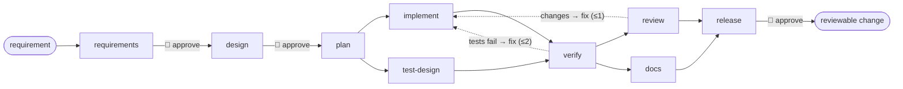

# Agentic SDLC System — URL Shortener

An orchestrator that takes a plain-English requirement and drives it through a software delivery
lifecycle: AI agents do the work, humans approve the high-impact steps, and every decision, retry,
rollback and policy verdict is recorded. The system it develops is a production-shaped .NET 9 URL
shortener. Both are in this repository.



Principle: **agents execute under defined autonomy boundaries; humans own oversight, approvals and
final quality.** The graph, the gates, the loop budgets and the policies are declared in
[`workflows/sdlc.yaml`](workflows/sdlc.yaml); no agent can change them.

---

## Start here — the reviewer's tour

| Assessment deliverable | Read |
|---|---|
| **Architecture overview** — components, orchestration model, control flow, key decisions | [docs/architecture.md](docs/architecture.md) · [docs/adr/](docs/adr/README.md) |
| **Three scenarios** — greenfield, brownfield, ambiguous: decomposition, orchestration, validation | [docs/scenarios/](docs/scenarios/README.md) |
| **Setup instructions** | [Run it](#run-it) below · [docs/runbook.md](docs/runbook.md) |
| **Testing approach, limitations, trade-offs** | [docs/testing.md](docs/testing.md) · [docs/tradeoffs.md](docs/tradeoffs.md) |
| **Final engineering summary** — plan, rationale, artifacts, risks, assumptions, limitations, what the AI got wrong | [docs/engineering-summary.md](docs/engineering-summary.md) |
| **Requirement → code → evidence** for every assessment criterion | [TRACEABILITY.md](TRACEABILITY.md) |
| The plan this was built from, with the up-front decisions | [PLAN.md](PLAN.md) |
| What each agent is told | [prompts/](prompts/) · [CLAUDE.md](CLAUDE.md) (shared with humans) |

Ten minutes: `architecture.md` §1–3, then one scenario walkthrough, then `engineering-summary.md`.

---

## Run it

Prerequisites: .NET 9 SDK, git. No Docker for the default paths.

**1. Tests** — orchestrator engine (96), shortener unit (39) and integration (14; 4 need Docker and skip):

```bash
dotnet test
```

**2. The dashboard** — stage graph, live agent activity, artifacts, policy verdicts, approvals,
metrics, lineage, audit chain:

```bash
dotnet run --project src/Orchestrator.Host
```

Open http://localhost:5100, pick a scenario (or write your own requirement) and start a run.

**3. A live run** needs a model API key in the host's environment — it is read from the
environment only and never written to disk:

```bash
$env:GEMINI_API_KEY = "..."      # or ANTHROPIC_API_KEY / OPENAI_API_KEY
dotnet run --project src/Orchestrator.Host
```

Tick *live*; you decide at each approval gate in the browser. Headless equivalents:

```bash
dotnet run --project src/Orchestrator.Host -- run greenfield --live --provider gemini
dotnet run --project src/Orchestrator.Host -- run --requirement my-requirement.md --baseline git:v1-legacy --live
```

**4. Replay without a key.** Every live run records its model exchanges and human decisions under
`runs/<id>/recording/`; a *successful* live scenario run also publishes them to
`recordings/<scenario>/`. Once a scenario has a recording, this replays it end to end — real
`dotnet build`/`test` in the sandbox, recorded model turns, recorded decisions labelled as such:

```bash
dotnet run --project src/Orchestrator.Host -- run greenfield
```

The [scenario walkthroughs](docs/scenarios/README.md) say which recordings exist.

**5. The shortener on its own**

```bash
dotnet run --project src/Shortener.Api                                    # in-memory; http://localhost:8080
dotnet run --project load/Shortener.LoadTest -- http://localhost:8080 32 10   # redirect p99 vs SLO
docker compose --profile real up -d                                       # Postgres + Redis (+ Redpanda)
RUN_DOCKER_TESTS=1 dotnet test tests/Shortener.IntegrationTests
```

API contract: [docs/openapi.yaml](docs/openapi.yaml). Tag `v1-legacy` is the deliberately
pre-event-driven baseline the brownfield scenario modernizes.

---

## Layout

```
src/Orchestrator.Core        the runtime: Workflow · Engine · Governance · State · Metrics · Contracts
src/Orchestrator.Agents      Llm adapters + record/replay · Agents · Tools · Codebase (Roslyn) · Workspace
src/Orchestrator.Host        ASP.NET Core: REST + SSE, dashboard (wwwroot), headless mode
src/Shortener.{Core,Infrastructure,Api}   the product
workflows/                   the lifecycle graph (sdlc.yaml)
scenarios/ requirements/     the three presets and their requirement texts
prompts/                     what each agent role is told
recordings/                  committed replay evidence (published by successful live scenario runs)
tests/                       Orchestrator.Tests · Shortener.UnitTests · Shortener.IntegrationTests
docs/                        architecture, ADRs, scenarios, testing, trade-offs, runbook, engineering summary, openapi
runs/ workspace/             per-run output and sandboxes (git-ignored)
```

One concept per file, one folder per concern. Conventions the agents and humans both follow:
[CLAUDE.md](CLAUDE.md).
