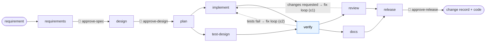
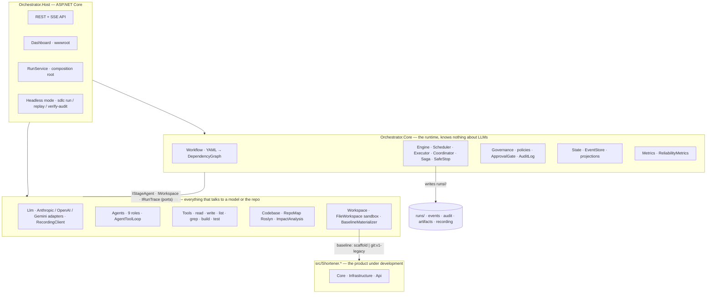
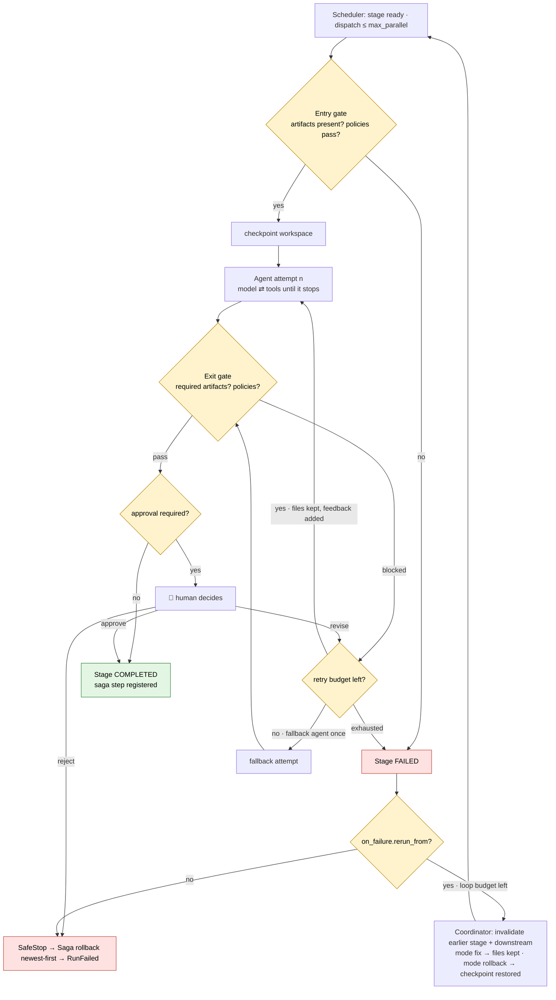
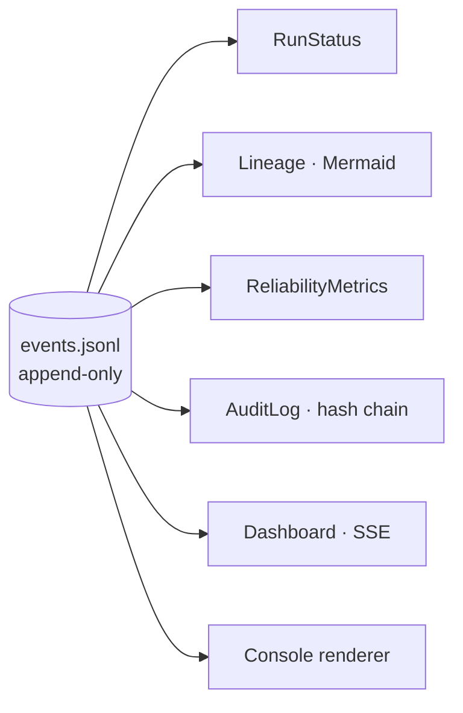

# Architecture

An orchestrator takes a plain-English requirement and drives it through a software delivery
lifecycle — requirements, design, planning, implementation, verification, review, documentation,
release readiness — with AI agents doing the work and humans approving the high-impact steps.
The system it develops is a .NET 9 URL shortener. The orchestrator is itself an ASP.NET Core
service. Both live in this repository.

Every box below is one file or one folder with that name in `src/`. See [the layout](../README.md#layout).

---

## 1. The lifecycle at a glance



- Solid arrows are `depends_on` edges from [`workflows/sdlc.yaml`](../workflows/sdlc.yaml).
  `implement ‖ test-design` and `review ‖ docs` run in parallel; `verify` and `release` are joins.
- 👤 marks a human approval gate. Nothing passes it without a recorded decision.
- Dotted arrows are the bounded re-plan loops. `verify` is deterministic (`dotnet build` + `dotnet test`), not a model.

---

## 2. Components



`Orchestrator.Core` sees only `IStageAgent.ExecuteAsync(StageContext)`. That is why the whole
engine is tested with delegate agents (`tests/Orchestrator.Tests/Fakes`) and why the deterministic
`VerifierAgent` is a first-class stage next to the model-backed ones.

---

## 3. Control flow

What happens to one stage, from being ready to being done:



Every transition above appends to the `EventStore` before it is visible anywhere else.

### The escalation ladder

A failing implementation climbs this ladder; each rung is bounded in the workflow file and none
is chosen by an agent:

| Rung | Trigger | What happens | Workspace |
|---|---|---|---|
| 1. Retry | transient error, malformed output, policy block, human "revise" | same stage, next attempt, feedback attached | **kept** — policies are evaluated over everything changed since the stage started |
| 2. Fix loop | a downstream verdict (`verify` or `review` fails) | `on_failure.rerun_from` with `mode: fix` — the earlier stage re-runs seeing its own files and the failure | **kept** — its saga step stays registered |
| 3. Rollback | `mode: rollback`, or an upstream artifact changed under completed stages | earlier stage's checkpoint restored; it starts over | restored |
| 4. Safe stop | loop budget exhausted, human rejection, Ctrl+C, stop button | agents cancelled, `Saga` compensates every completed stage newest-first | restored to the baseline |

The distinction that matters: a **verdict** ("your tests fail") is a reason to fix the work; a
**stale input** ("the spec you built on changed") is a reason to redo it. The first version of
this runtime treated both as rollback; a live run showed the implementer receiving compiler errors
about files that no longer existed. See [tradeoffs.md](tradeoffs.md).

### Re-planning paths that actually occur

- **verify fails → implement re-runs** with the test output as feedback (`max_loops: 2, mode: fix`). Everything downstream of `implement` (docs) is invalidated and compensated first.
- **reviewer requests changes → implement re-runs** once (`max_loops: 1, mode: fix`).
- **human sends a spec/design back** → the same stage re-runs with the note as feedback; downstream stages have not started.
- **policy blocks an exit gate** → the stage retries with the block reason as feedback, inside its retry budget.
- **an artifact is re-produced with a different hash** while stages that consumed it are complete → `Coordinator.ReactToArtifactsAsync` invalidates and restores them.

---

## 4. Governance

| Mechanism | Where | What it enforces |
|---|---|---|
| Platform boundary | `prompts/_shared.md`, `prompts/requirements.md` | The pipeline delivers .NET 9 solutions only. A requirement needing another toolchain becomes `AMB-1 PLATFORM:` with re-scope/stop options and halts at `approve-spec`, instead of failing at `verify` five stages later. |
| Approval gates | `workflows/sdlc.yaml` `approval:` + `Governance/ApprovalGate.cs` | Humans sign off the spec, the design and the release. Decisions get ids (`D001…`) and are cited by later stages. |
| `no-secrets` | `Governance/Policies/NoSecretsPolicy.cs` | No credential-shaped strings in artifacts or changed files. |
| `pii-in-logs` | `Governance/Policies/PiiInLogsPolicy.cs` | No log statement interpolates a full URL, IP or user agent. |
| `schema-change-needs-approval` | `Governance/Policies/SchemaChangeNeedsApprovalPolicy.cs` | Any DDL must name a table the *approved* design mentions. |
| `segregation-of-duties` | `Governance/Policies/SegregationOfDutiesPolicy.cs` | The reviewer role is never the implementer role. |
| Sandbox | `Workspace/FileWorkspace.cs` | Agents cannot read or write outside `workspace/<run>/`. |
| Tool allow-list | `Tools/` | No shell. Only read/write/edit/list/grep and `dotnet build` / `dotnet test`. |
| Policy pre-check on writes | `Tools/FilePolicyCheck.cs` | `write_file`/`edit_file` evaluate `no-secrets` and `pii-in-logs` on the file at once and warn in the tool result; the exit gate still enforces. |
| Bounded everything | `RetryPolicy`, `on_failure.max_loops`, `AgentToolLoop` iteration cap, provider retry cap | No unbounded loop anywhere. |
| Safe stop | `Engine/SafeStop.cs` | One switch cancels agents, then `Saga` rolls back completed stages newest-first. |
| Audit | `Governance/AuditLog.cs` | Governance events written with a hash chain; `sdlc verify-audit` detects edits. |

---

## 5. State and observability

The `EventStore` is the source of truth: append-only, written to `runs/<id>/events.jsonl` before
it is visible in memory. `RunStatus`, `Lineage`, `ReliabilityMetrics`, the audit log, the dashboard
and the console renderer are all projections of it. Agent activity (`ModelCallStarted`,
`AgentTurn`, `ToolStarted`, `ToolInvoked`, provider retries) is in the same stream, which is how
the dashboard shows what each agent is doing while it does it.



Metrics per run: stage success rate, retries, fallbacks, re-plans, rollbacks, policy blocks, human
rejections/revisions, MTTR (first failed attempt → completion), per-stage and end-to-end latency.

---

## 6. Agents

| Role | Backed by | Reads | Produces | Tools |
|---|---|---|---|---|
| requirements | LLM | requirement (+ repo map & impact analysis when code exists) | `spec` — JSON: scope, Given/When/Then criteria, ambiguities with options, assumptions | read-only |
| architect | LLM | spec | `design` — markdown: components, data flow, schema changes, ADRs, impacted files, risks | read-only |
| planner | LLM | spec, design | `plan` — JSON work items: key, AC ids, depends-on, risk, files; validated as a DAG | read-only |
| implementer | LLM | spec, design, plan (+ feedback) | `implementation` — summary + files changed (computed by the orchestrator) | read/write/edit/build/test |
| test-designer | LLM | spec, design, plan | `test-plan` — independent test cases per AC, reviewer checklist | read-only |
| verifier | **deterministic** | — | `test-report` from `dotnet build` + `dotnet test`; failure → feedback | build/test |
| reviewer | LLM | spec, design, implementation, test-plan, test-report | `review` ending in `VERDICT: APPROVE` or `REQUEST_CHANGES` | read-only |
| doc-writer | LLM | spec, design, implementation | `documentation` — feature doc + runbook written into the workspace | read/write/edit |
| release-manager | LLM | everything above | `change-record` — JSON: risk rating, blast radius, rollback plan, evidence, checklist | read-only |

Every LLM role shares one loop (`AgentToolLoop`): send system prompt + conversation + tool
definitions, execute all requested tools, return the results in one message, repeat until the
model stops or the iteration cap is hit. Prompts are files under [`prompts/`](../prompts/), one per
role, plus `_shared.md` and the repository's own [`CLAUDE.md`](../CLAUDE.md) — the same conventions
a human contributor reads.

Provider access is raw `HttpClient` against Anthropic, OpenAI and Gemini (no SDKs), behind
`ILlmClient`. `RecordingClient` wraps any of them: live runs write every exchange to
`recording/llm/`; replays match by request hash and fall back to sequence order (reported) when a
tool result drifted. Assistant turns are stored as the provider's raw content so thinking blocks
and function-call ids round-trip unchanged.

---

## 7. Codebase reasoning (brownfield)

No embeddings. `RepoMap` parses every `.cs` file with Roslyn syntax trees (no compilation) into
type signatures, public members and referenced identifiers. `ImpactAnalysis` scores files from
seed terms pulled out of the requirement (backticked identifiers weigh more than prose words) and
pulls in second-order files that reference the hit types. It is deterministic, so a walkthrough is
reproducible. Both sit behind `ICodebaseIndex`; for a large repository an embedding-backed index
would replace `RoslynCodebaseIndex` without touching any agent ([ADR-006](adr/ADR-006-roslyn-repo-map-not-rag.md)).

---

## 8. Runs, presets and recordings

A run is `RunRequest` → `RunSpec` (requirement text, baseline, workflow) → `runs/<id>/`:

```
runs/<id>/
  run.json          what was asked, so the run can be replayed by id
  events.jsonl      the log; everything else derives from it
  audit.jsonl       governance events with the hash chain
  artifacts/        spec.json, design.md, plan.json, implementation.md, test-plan.md, …
  output/           every workspace file the agents created or changed
  recording/        llm/*.json exchanges + decisions.jsonl (live runs only)
  metrics.txt, lineage.mmd
```

Presets in [`scenarios/`](../scenarios/) are the three assessment cases (requirement file +
baseline). A live preset run that **succeeds** publishes its recording to `recordings/<scenario>/`
so it can be replayed with no key. An ad-hoc requirement typed into the dashboard runs the same
graph ([ADR-008](adr/ADR-008-any-requirement-presets-are-examples.md)).

Baselines: `scaffold` (build configuration only — greenfield), `git:v1-legacy` (the shortener
with synchronous click counting — brownfield and ambiguous), `git:HEAD` or any tag.

---

## 9. The product: URL shortener

`Shortener.Core` (domain + ports, no packages) · `Shortener.Infrastructure` (in-memory, Postgres
via Npgsql/Dapper behind a Polly pipeline, Redis) · `Shortener.Api` (minimal API: create,
redirect, stats, health probes; Serilog JSON, OpenTelemetry, correlation ids, rate limiting).
[`docs/openapi.yaml`](openapi.yaml) is the contract.

v1 (tag `v1-legacy`) records clicks with a synchronous row update on the redirect path — measured
at 293 rps / p99 684 ms against real Postgres — which is the problem the brownfield scenario asks
the agents to fix with an outbox and a consumer.

---

## 10. Key decisions

One line each in [`PLAN.md` §0](../PLAN.md); full context and consequences in [`docs/adr/`](adr/README.md).
