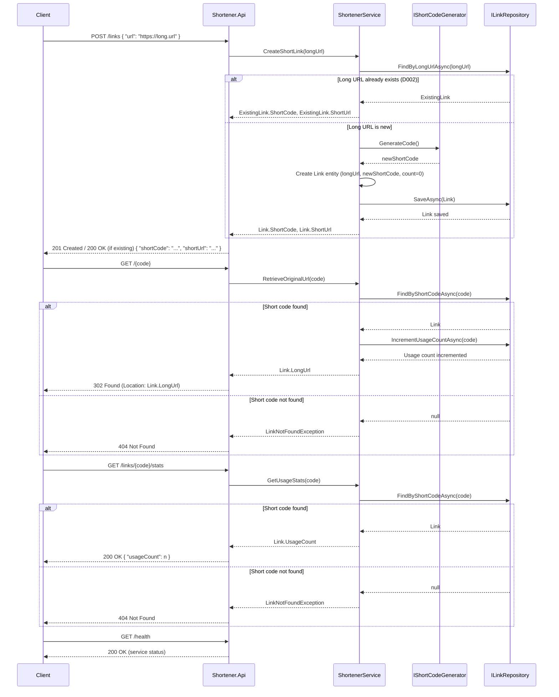

## Summary
This design outlines a greenfield .NET 9 URL shortener service. It will provide endpoints for creating short links, redirecting from short links to original URLs, and retrieving usage statistics. The core functionality is built around a pluggable repository pattern, initially using an in-memory store, with a design anticipating a PostgreSQL backend.

## Components

*   **Link** (new, `Shortener.Core`):
    *   **Responsibility**: Represents the domain entity for a shortened URL, holding the long URL, short code, and usage count.
    *   **Dependencies**: None.
*   **ILinkRepository** (new, `Shortener.Core/Ports`):
    *   **Responsibility**: Defines the contract for persisting and retrieving `Link` entities and their usage statistics.
    *   **Dependencies**: None.
*   **InMemoryLinkRepository** (new, `Shortener.Infrastructure`):
    *   **Responsibility**: In-memory adapter implementing `ILinkRepository` using `ConcurrentDictionary` for thread-safe storage.
    *   **Dependencies**: `ILinkRepository`.
*   **IShortCodeGenerator** (new, `Shortener.Core/Ports`):
    *   **Responsibility**: Defines the contract for generating unique, non-guessable short codes.
    *   **Dependencies**: None.
*   **EightCharacterAlphanumericCodeGenerator** (new, `Shortener.Infrastructure`):
    *   **Responsibility**: Generates 8-character alphanumeric short codes (case-sensitive) using a cryptographically secure random number generator (per D003).
    *   **Dependencies**: `IShortCodeGenerator`.
*   **ShortenerService** (new, `Shortener.Core`):
    *   **Responsibility**: Encapsulates the core business logic, including creating links, retrieving original URLs, and managing usage counts. It orchestrates interactions between the short code generator and the repository. Handles pre-checking for existing long URLs (per D002).
    *   **Dependencies**: `ILinkRepository`, `IShortCodeGenerator`.
*   **Program.cs** (modified/new, `Shortener.Api`):
    *   **Responsibility**: Configures the ASP.NET Core application, registers services (including `ShortenerService` and repository implementations), maps API endpoints, and sets up health checks and structured logging.
    *   **Dependencies**: `ShortenerService`, `ILinkRepository`, `IShortCodeGenerator`.
*   **CreateShortLinkRequest** (new, `Shortener.Api`):
    *   **Responsibility**: Data Transfer Object for the `POST /links` request body.
    *   **Dependencies**: None.
*   **ShortLinkResponse** (new, `Shortener.Api`):
    *   **Responsibility**: Data Transfer Object for the `POST /links` and `GET /links/{code}/stats` responses.
    *   **Dependencies**: None.
*   **tests/Shortener.UnitTests** (new, `tests/Shortener.UnitTests`):
    *   **Responsibility**: Contains unit tests for `ShortenerService`, `InMemoryLinkRepository`, and `EightCharacterAlphanumericCodeGenerator`.
    *   **Dependencies**: `Shortener.Core`, `Shortener.Infrastructure`.
*   **tests/Shortener.IntegrationTests** (new, `tests/Shortener.IntegrationTests`):
    *   **Responsibility**: Contains integration tests for the `Shortener.Api` endpoints.
    *   **Dependencies**: `Shortener.Api`.

## Data flow



## Schema changes
### For future PostgreSQL implementation:
*   **Table**: `ShortenedLinks`
    *   `Id` (UUID, PK) - Auto-generated unique identifier.
    *   `ShortCode` (VARCHAR(8), UNIQUE, NOT NULL) - The generated short code (per D003).
    *   `LongUrl` (TEXT, UNIQUE, NOT NULL) - The original long URL.
    *   `UsageCount` (BIGINT, NOT NULL, DEFAULT 0) - Counter for how many times the link has been followed.
    *   `CreatedAt` (TIMESTAMP WITH TIME ZONE, NOT NULL, DEFAULT NOW()) - Timestamp of link creation.

## API changes

*   **`POST /links`**
    *   **Request**: `application/json`
        ```json
        {
          "url": "string" // The long URL to shorten
        }
        ```
    *   **Response (201 Created)**: `application/json`
        ```json
        {
          "shortCode": "string", // The generated short code
          "shortUrl": "string"   // The full short URL (e.g., https://short.svc/{code})
        }
        ```
    *   **Response (200 OK)**: `application/json` (If the long URL already exists, per D002)
        ```json
        {
          "shortCode": "string", // The existing short code
          "shortUrl": "string"   // The existing full short URL
        }
        ```
    *   **Response (400 Bad Request)**: `application/problem+json` (For invalid or malformed URL input)
*   **`GET /{code}`**
    *   **Request**: Path parameter `code` (string, the short code)
    *   **Response (302 Found)**: Redirects to the `LongUrl` in the `Location` header.
    *   **Response (404 Not Found)**: `application/problem+json` (If the short code does not exist)
*   **`GET /links/{code}/stats`**
    *   **Request**: Path parameter `code` (string, the short code)
    *   **Response (200 OK)**: `application/json`
        ```json
        {
          "usageCount": 0 // The number of times the link has been followed
        }
        ```
    *   **Response (404 Not Found)**: `application/problem+json` (If the short code does not exist)
*   **`GET /health`**
    *   **Request**: None
    *   **Response (200 OK)**: Plain text or empty body, indicating service health.

## Decisions

### ADR-1: Handling Duplicate Long URLs
*   **Context**: Requirement REQ-GF-1 states "Engineers paste a long URL and get a short one back". Ambiguity AMB-1 asked whether submitting the same long URL multiple times should generate a new short code or return the existing one.
*   **Decision**: As per D002 (AMB-1, Option B), the service will return the existing short code if the long URL has already been shortened. A new code is only generated if the URL is new to the system. This optimizes storage and provides a consistent user experience.
*   **Consequences**: The `ILinkRepository` interface and its implementations (e.g., `InMemoryLinkRepository`) must support looking up links by `LongUrl`. The `ShortenerService`'s `CreateShortLink` method will first attempt a lookup by `LongUrl` before generating a new short code. The `POST /links` endpoint will return a 200 OK with the existing link if found, otherwise 201 Created.

### ADR-2: Short Code Generation Strategy
*   **Context**: The requirement states "Links must not be guessable from one another." Ambiguity AMB-2 concerned the length and character set of the generated short codes.
*   **Decision**: As per D003 (AMB-2, Option A), short codes will be fixed at 8 alphanumeric characters (a-z, A-Z, 0-9). They will be case-sensitive and generated using a cryptographically secure pseudo-random number generator (per assumptions).
*   **Consequences**: A concrete `IShortCodeGenerator` implementation, `EightCharacterAlphanumericCodeGenerator`, will be created to enforce these rules. The fixed length balances unguessability with conciseness.

## Impacted files

*   **New files**:
    *   `src/Shortener.Core/Link.cs`: Defines the domain entity for a short link.
    *   `src/Shortener.Core/Ports/ILinkRepository.cs`: Interface for data persistence.
    *   `src/Shortener.Core/Ports/IShortCodeGenerator.cs`: Interface for short code generation.
    *   `src/Shortener.Core/ShortenerService.cs`: Core business logic service.
    *   `src/Shortener.Infrastructure/InMemoryLinkRepository.cs`: In-memory implementation of `ILinkRepository`.
    *   `src/Shortener.Infrastructure/EightCharacterAlphanumericCodeGenerator.cs`: Implementation of `IShortCodeGenerator`.
    *   `src/Shortener.Api/Program.cs`: Main entry point, service configuration, and endpoint definitions.
    *   `src/Shortener.Api/Models/CreateShortLinkRequest.cs`: DTO for POST request.
    *   `src/Shortener.Api/Models/ShortLinkResponse.cs`: DTO for API responses.
    *   `tests/Shortener.UnitTests/ShortenerServiceTests.cs`: Unit tests for `ShortenerService`.
    *   `tests/Shortener.UnitTests/InMemoryLinkRepositoryTests.cs`: Unit tests for `InMemoryLinkRepository`.
    *   `tests/Shortener.UnitTests/EightCharacterAlphanumericCodeGeneratorTests.cs`: Unit tests for `EightCharacterAlphanumericCodeGenerator`.
    *   `tests/Shortener.IntegrationTests/ShortenerApiIntegrationTests.cs`: Integration tests for API endpoints.
*   **Modified files**: None (as this is a greenfield project in an empty workspace).

## Risks and mitigations

| Risk                                     | Likelihood | Impact | Mitigation                                                                                                                                                                                                                               |
| :--------------------------------------- | :--------- | :----- | :--------------------------------------------------------------------------------------------------------------------------------------------------------------------------------------------------------------------------------------- |
| Short code collision                     | Low        | High   | Implement a robust `IShortCodeGenerator` (per D003) with cryptographically secure random number generation. The `ILinkRepository` will enforce uniqueness, allowing retries in `ShortenerService` if a collision occurs during creation. |
| Performance degradation under load       | Medium     | Medium | Use `ConcurrentDictionary` for `InMemoryLinkRepository`. Ensure efficient data access patterns. Structured logging and health endpoints provide visibility. Design for eventual switch to high-performance database.                    |
| Data loss with in-memory store           | Medium     | High   | Clearly communicate that the in-memory store is for development only and unsuitable for production. Prioritize the PostgreSQL implementation after initial in-memory solution is stable.                                            |
| Unclear error messages                   | Low        | Medium | Use ASP.NET Core Problem Details (RFC 7807) for API error responses (e.g., 400 Bad Request, 404 Not Found), providing consistent and machine-readable error information.                                                                 |
| PII exposure in logs                     | Low        | High   | Implement structured logging strictly following the `PiiInLogsPolicy`. The `LongUrl` itself will be logged carefully, and never client IPs or user agents.                                                                                 |
| Service unavailability due to external DB | N/A (initial in-memory) | High   | For future PostgreSQL: Implement retry mechanisms with exponential backoff and circuit breakers for database interactions (per assumptions) to handle transient failures and prevent cascading failures.                                |

## Out of scope

This design deliberately does not include:
*   Custom short link aliases.
*   Expiry dates for short links.
*   Any user interface (UI).
*   User authentication or authorization.
*   Any platform or runtime other than .NET 9.
*   Advanced monitoring beyond basic health checks and structured logging (e.g., custom metrics, distributed tracing).
*   Any database persistence beyond the conceptual schema for PostgreSQL and the initial in-memory implementation.